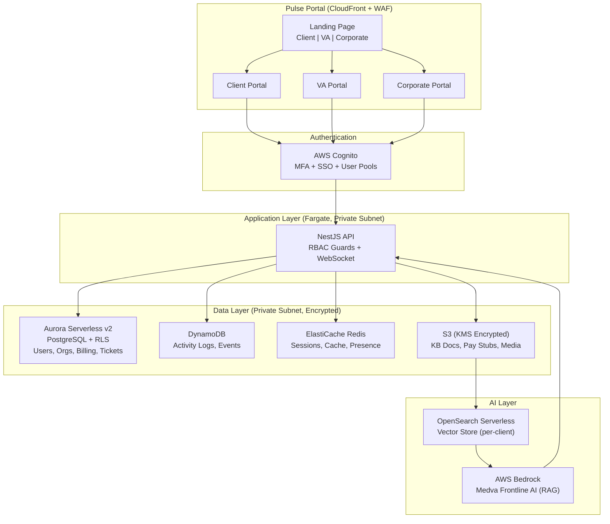

# MEDVA Pulse Portal -- Technical & Organizational Proposal

**Prepared by:** Jimmy Rhoades
**Date:** April 8, 2026

---

## 1. Technology Stack Recommendation

**Core Stack (AWS ecosystem, every service HIPAA BAA-eligible)**

| Layer | Choice | Why This / Trade-offs |
|-------|--------|----------------------|
| **Frontend** | Next.js 15 + TypeScript + Tailwind + shadcn/ui | SSR for fast dashboards, co-located API routes, massive offshore React talent pool. Steeper than plain React but worth the velocity. |
| **Backend** | NestJS (TypeScript) on Fargate | Full TS parity with frontend -- any engineer works anywhere. Built-in RBAC guards, validation, OpenAPI. Enterprise structure without Java overhead. |
| **Architecture** | Modular monolith | At team size 5, microservices = infrastructure overhead that kills velocity. Clean domain boundaries (auth, billing, messaging, AI) ready for extraction when we scale past 15 engineers. |
| **Database** | Aurora Serverless v2 (PostgreSQL) + RLS | Auto-scales with load, zero idle cost off-hours. Row-Level Security enforces tenant isolation at the database level. DynamoDB for high-volume events only (activity logs, chat receipts). |
| **Auth** | AWS Cognito + NestJS Guards | Cognito handles MFA, SSO, user pools out of the box. HIPAA-eligible. Don't reinvent auth with a 5-person team. NestJS guards enforce RBAC at the API layer. |
| **AI** | AWS Bedrock (Claude) + OpenSearch Serverless | Claude via Bedrock: strongest instruction-following and RAG grounding for KB chatbot. Managed, HIPAA-eligible, pay-per-call. OpenSearch for per-client vector storage. |
| **Infra** | VPC + Fargate + S3 + CloudFront + WAF + KMS | Fargate over EKS -- no cluster tax for a team of 5. Private subnets for all data services. |
| **CI/CD** | GitHub + GitHub Actions + Terraform + Docker | Single source of truth. Every AWS resource is IaC. Build/test/deploy on every PR merge. |
| **Observability** | CloudWatch + X-Ray + Sentry + PagerDuty | Native AWS metrics + distributed tracing + application error tracking + on-call alerting. |

**HIPAA/SOC 2 influence on every choice:** All services BAA-covered. Encryption at rest (KMS) and in transit (TLS 1.2+). Private subnets only -- zero public DB access. CloudTrail + custom audit tables for all data access. Zero developer production access. WAF + GuardDuty. I went through SOC 2/HITRUST certification at ilumed -- compliance baked in from Day 1 costs a fraction of retrofitting it later.

**Internal dev tooling (assuming nothing exists):** GitHub, Linear, Figma, Notion, Slack, Claude Code, 1Password Business. **~$370/mo for 5 people.**

---

## 2. Team Composition & Hiring Plan

**Assumption:** I am Employee #1, writing 60-70% of foundational backend and architecture code personally.

| Priority | Role | Location | Seniority | Key Skills | Salary Range | Start |
|----------|------|----------|-----------|------------|-------------|-------|
| 1 | **DevOps & Security Engineer** | **US-based** | Senior (5-8 yr) | AWS, Terraform, HIPAA/SOC 2, pen-testing, CI/CD | $155K-$175K | Week 1 |
| 2 | **Lead Backend Engineer** | Offshore | Senior (5+ yr) | NestJS, PostgreSQL, RBAC, AWS, English fluency | $40K-$55K | Week 1-2 |
| 3 | **Full-Stack Engineer** | Offshore | Mid-Senior (3-5 yr) | Next.js, TypeScript, REST APIs, charting | $35K-$50K | Week 2-3 |
| 4 | **UI/UX Engineer** | Offshore | Mid (2-4 yr) | React/Next.js, Tailwind, Figma-to-code, accessibility | $25K-$40K | Month 2-3 |

**Why US-based DevOps first:** HIPAA-compliant infrastructure is the foundation everything else sits on. This person owns VPC, encryption, CI/CD, monitoring, and security posture from Day 1 so I'm free to focus on application architecture. Compliance mistakes are the most expensive to fix later.

**Interview process by role:**

- **DevOps/Security (US):** Infrastructure scenario ("Design a HIPAA-compliant AWS environment for a multi-tenant app -- walk me through VPC, subnets, encryption, IAM"), Terraform take-home (2 hrs), culture/system-design interview with me + John.
- **Lead Backend (Offshore):** Live pair-programming session on a tenant-isolated API endpoint, system design discussion (multi-tenant RBAC), English communication assessment, references focused on remote effectiveness.
- **Full-Stack (Offshore):** Live coding (React component + API integration), code review exercise (find issues in a PR), portfolio review.
- **UI/UX (Offshore):** Figma-to-code live build (recreate a dashboard component), code review exercise, portfolio/GitHub review.

**Who's most critical:** DevOps + Lead Backend. These two plus me form the core that can ship MVP. UI/UX engineer can wait until the design system is established.

**Team evolution MVP to V1:** During MVP, I write core backend + architecture. During V1 (AI), I shift to Bedrock integration and AI pipeline. Lead Backend steps up as day-to-day feature lead. Consider adding a contract AI/ML engineer for RAG optimization.

---

## 3. Product Roadmap: MVP to V1 to V2

### Assumptions (Called Out)

1. MEDVA's existing PULSE portal continues operating -- no hard cutover deadline
2. We can get API or data access to current systems (HubSpot, Thinkific, billing) for migration
3. Offshore hiring leverages MEDVA's existing Philippines infrastructure
4. 10-20% client adoption is the MVP pilot target

### MVP (10 weeks) -- Foundation

**Goal:** Unified portal entry point with three role-based experiences, real data, secure messaging.

| Weeks | Deliverables |
|-------|-------------|
| 1-3 | AWS environment via Terraform, CI/CD pipeline, Cognito auth + RBAC, multi-tenant data model with RLS, portal landing page ("I am a Client / VA / MEDVA Employee") |
| 4-6 | Client portal: KPI dashboard (Total Spend, Active VAs, Hours Logged, Pending Invoices), Cost Efficiency chart, "My Team" with VA cards and performance scores. Corporate portal: account overview, VA management, revenue analytics, retention risk alerts. |
| 7-9 | VA portal: profile, schedule (weekly calendar), performance self-view, MEDVA alerts. Secure messaging (WebSocket, E2E encrypted, threaded). IT ticketing (integrate existing tool via API). |
| 10 | Security audit, pilot launch to 10-20% of clients |

### V1 (+14 weeks, ~6 months total) -- Medva Frontline AI + Academy

**Goal:** Client-specific AI chatbot, built-in training platform, Stripe billing. New revenue stream.

| Weeks | Deliverables |
|-------|-------------|
| 11-14 | Bedrock RAG pipeline: client KB upload with auto-indexing progress UI, document parsing/chunking/embedding, OpenSearch vector storage with per-client isolation |
| 15-18 | Medva Frontline AI: conversational chatbot with chat history, client-specific responses with source citations, AI Extensions framework (Open Evidence, third-party medical AI tools as client-toggleable integrations) |
| 19-22 | Medva Academy (training modules with progress tracking, HIPAA training, ICD-10 updates). Stripe billing (CC + ACH). VA pay stubs (integrated with billing pipeline). Schedule management. |
| 23-24 | Load testing, AI security audit (cross-tenant leakage testing), full client rollout |

### V2 (Months 9-14) -- Scale & Intelligence

Matching/assignment engine (rule-based, then ML-enhanced -- deferred to V2 because effective matching requires stable assignment data and usage patterns from MVP/V1). Advanced predictive analytics (client health scoring, utilization optimization). EHR integrations (Epic via MEDVA Secure Facility, Athena). React Native mobile app for VAs. Self-service client onboarding. API platform for enterprise clients.

### Technical Risks & Mitigations

| Phase | Risk | Mitigation |
|-------|------|------------|
| MVP | Data isolation / HIPAA breach | `organization_id` on every table + RLS + automated security scans in CI + external pen-test before pilot |
| MVP | Data migration delays | Start migration analysis Week 1, run in shadow mode before cutover |
| MVP | Scope creep | Lock MVP scope with John upfront. Weekly demos. Say no to anything that doesn't serve the pilot group. |
| V1 | AI cross-tenant data leakage | Per-client OpenSearch namespaces + mandatory `org_id` filter at infrastructure level + nightly automated cross-tenant test suite |
| V1 | AI hallucination / quality | RAG grounds responses in uploaded docs. Confidence scoring. Low-confidence responses flagged for human review. |
| V1 | AI cost overrun | Per-client usage quotas, prompt caching, start with cost-efficient model tier |
| Both | Offshore ramp-up slower than planned | US DevOps hired first as insurance. Async-first process: detailed specs, Loom walkthroughs, 2-3 hr daily overlap window. |

---

## 4. Architecture Overview

### System Diagram

### Authentication & RBAC

- **Cognito** handles user pools, MFA (required for PHI access), SSO (SAML/OIDC for enterprise clients)
- **JWT tokens:** 15-min access, 7-day rotating refresh
- **NestJS Guards** enforce role + resource ownership on every API endpoint
- **Five roles:** Client Admin, Client User, Virtual Assistant, MEDVA Corporate, MEDVA Admin
- **Defense in depth:** Application-level RBAC + database-level RLS. Even if app logic has a bug, the database won't return another tenant's data.

### Multi-Tenancy Strategy

**Shared database, logical isolation via `organization_id` + PostgreSQL RLS.**

Every tenant-data table has `organization_id`. RLS policies enforce `WHERE organization_id = current_setting('app.current_org')` at the database level. Not separate databases per tenant -- at 1,000+ clients that's unmanageable (schema migrations become fleet operations, cross-tenant analytics for corporate staff requires federation).

### AI KB Document Isolation (Highest HIPAA Risk Area)

1. Client uploads document --> S3 (`s3://kb-docs/{org_id}/`), encrypted via KMS
2. Async pipeline (SQS + Lambda): parse, chunk, embed
3. Embeddings stored in OpenSearch with `org_id` metadata tag
4. VA asks question --> OpenSearch query with **mandatory `org_id` filter** (infrastructure-level, not application-level)
5. Retrieved chunks + question sent to Claude via Bedrock (stateless -- no client data persists in LLM)
6. Response returned with source citations from that client's KB only
7. **Automated nightly cross-tenant query tests that must return zero results**

---

## 5. Budget & Vendor Management

### Monthly Cloud Infrastructure (10-20% adoption = 100-200 clients)

| Phase | Estimated Monthly Cost | Key Drivers |
|-------|----------------------|-------------|
| **MVP** | **$800 - $1,200** | Aurora Serverless (scales to zero off-hours), Fargate, S3, CloudFront |
| **V1** | **$2,200 - $2,900** | + Bedrock inference (~$500-$1,200 variable), OpenSearch, Lambda |
| **Full adoption** | **$8K - $12K** | Linear scaling with Fargate auto-scale + Bedrock usage |

### Annual Team Cost

| Role | Annual Cost (salary + overhead) |
|------|-------------------------------|
| DevOps & Security (US) | ~$195K |
| Lead Backend (Offshore) | ~$52K |
| Full-Stack (Offshore) | ~$46K |
| UI/UX (Offshore) | ~$37K |
| **Total (4 hires)** | **~$330K/year** |

### Software Licensing: ~$400/mo

GitHub, Linear, Figma, Notion, Slack, Claude Code, 1Password, Sentry, PagerDuty. Stripe fees are pass-through (2.9% + $0.30/txn).

### Cloud Spend Optimization

- **Aurora Serverless:** Auto-scales to near-zero during off-hours. No paying for idle capacity.
- **Savings Plans:** Commit to 1-year compute after MVP stabilizes (~35% savings).
- **Fargate Spot:** Non-critical workloads (document processing, batch jobs) at up to 70% discount.
- **Bedrock controls:** Per-client usage quotas, prompt caching, cost-efficient model tier first.
- **Dev environment shutdowns:** Auto-scale non-prod to zero nights/weekends.
- **Monthly FinOps reviews** with AWS Cost Explorer. Budget alerts at 80% and 100%.

### Build vs. Buy

| Capability | Decision | Why |
|------------|----------|-----|
| Auth | **Buy** (Cognito) | HIPAA-eligible, handles MFA/SSO. Don't reinvent with 5 people. |
| Messaging | **Build** | Core differentiator, needs E2E encryption + deep portal integration. Third-party chat (SendBird) scales poorly at 5,000+ VAs. |
| Medva Frontline AI | **Build** + **Buy** (Claude via Bedrock) | We build the RAG pipeline and UI. Claude via Bedrock provides managed LLM inference -- strongest model for grounding responses in retrieved documents, which is the core of the KB chatbot. |
| Medva Academy | **Build** (V1) | Mock-up shows deep portal integration. Thinkific can't deliver this. Migrate existing content. |
| AI Extensions | **Framework** | We build the pluggable framework. Third-party vendors (Open Evidence, etc.) provide their AI via API. |
| IT Ticketing | **Buy** (integrate) | Not a differentiator. Zendesk or Freshdesk via API. |
| Billing | **Buy** (Stripe) | PCI compliance, ACH, invoicing out of the box. Never build payment processing. |
| CRM | **Integrate** (HubSpot) | Already in use. Bi-directional sync, don't replace. |

**Framework:** Build if it's a core differentiator or touches PHI. Buy if it's commodity. Integrate if MEDVA already uses it and it works.

---

## Assumptions Summary

1. Existing PULSE portal continues operating during buildout -- parallel, not cutover
2. API/data access to current systems available for migration
3. AWS account with BAA provisioned (or will be)
4. Offshore hiring leverages MEDVA's existing Philippines HR infrastructure
5. John Anderson is primary stakeholder for scope decisions
6. 10-20% adoption (100-200 clients) for MVP/V1 cost modeling
